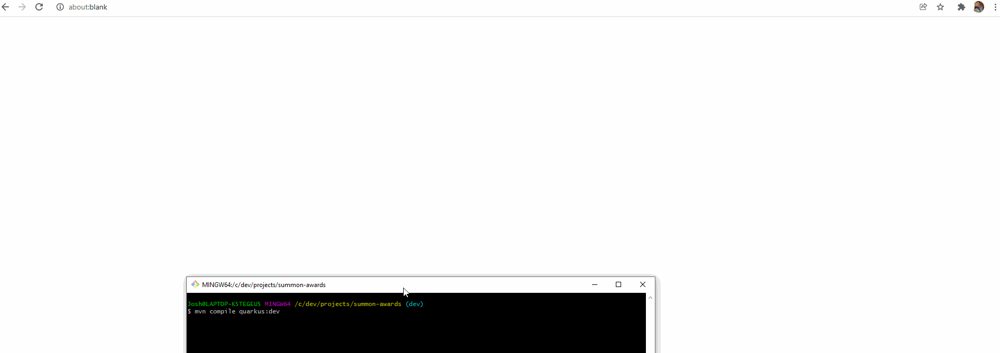

# summon-awards


Hi! This is just a simple sample *Quarkus application* that expos a few simple REST endpoints.

# Prerequisites

In order to run this application, you will need to install:

* Java 11 (or newer)
* Maven (I used version 3.8.4)

You'll also need to set/modify some environment variables:

* PATH (used to find your java and maven executables)
* JAVA_HOME (used by Maven to find the Java executable)

# Setup guide

## Java

I used the Java11 distribution of GraalVM for running this locally. You can find that [here](https://github.com/graalvm/graalvm-ce-builds/releases/tag/vm-21.3.0). High level, here are the steps to follow:
* Go to the GraalVM releases page (link above).
* Download the package appropriate for your machine.
* Unpack it somewhere (I put it in `c:\dev\tools\graalvm-ce-java11-21.0.0.2`).
* Modify your machine's PATH variable so that it include the graalvm distribution's /bin folder. This is needed so that it will use this when you invoke Java. For example, I appended this to my PATH variable: `c:\dev\tools\graalvm-ce-java11-21.0.0.2\bin`
* Modify or create an environment variable called `JAVA_HOME` and set it to your graalvm folder. In my case I set it to `c:\dev\tools\graalvm-ce-java11-21.0.0.2`. This is used by Apache Maven to identify which Java installation it should use.

To verify this is installed successfully, you can run `java -version` from a command prompt. You should see something like:
```
$ java -version
openjdk version "11.0.10" 2021-01-19
OpenJDK Runtime Environment GraalVM CE 21.0.0.2 (build 11.0.10+8-jvmci-21.0-b06)
OpenJDK 64-Bit Server VM GraalVM CE 21.0.0.2 (build 11.0.10+8-jvmci-21.0-b06, mixed mode, sharing)
```

## Maven

This project uses Apache Maven for its build and for dependency management. Here are the steps to follow to install it:
* Download from [here](https://maven.apache.org/download.cgi) - You want the 'Binary Archive'
* Unpack the archive somewhere on your machine. In my case I put it in `C:\dev\tools\apache-maven-3.8.4`  
* Add `C:\dev\tools\apache-maven-3.8.4\bin` to your machine's PATH variable. This is needed so your machine can find the `mvn` executable from the command line.

To verify you have maven setup appropriately, you can run `mvn -version`. You should see output like:
```
$ mvn -version
Apache Maven 3.8.4 (9b656c72d54e5bacbed989b64718c159fe39b537)
Maven home: C:\dev\tools\apache-maven-3.8.4
Java version: 11.0.10, vendor: GraalVM Community, runtime: C:\dev\tools\GraalVM\graalvm-ce-java11-21.0.0.2
Default locale: en_US, platform encoding: Cp1252
OS name: "windows 10", version: "10.0", arch: "amd64", family: "windows"
```

# How to run this project

Once you have completed the setup documented above, you can:
* Clone a copy of this project to your machine
* Navigate to the location where you cloned this project in a command line terminal
* Run this command: `mvn compile quarkus:dev`

After the command is finished processing, you should see output like:
```
__  ____  __  _____   ___  __ ____  ______
 --/ __ \/ / / / _ | / _ \/ //_/ / / / __/
 -/ /_/ / /_/ / __ |/ , _/ ,< / /_/ /\ \
--\___\_\____/_/ |_/_/|_/_/|_|\____/___/
2021-12-08 09:41:25,281 INFO  [io.quarkus] (Quarkus Main Thread) summon-awards 1.0.0 on JVM (powered by Quarkus 2.5.1.Final) started in 5.758s. Listening on: http://localhost:8080
```

You can also visit http://localhost:8080/q/dev/ at this point in a web browser to see the Quarkus dev console.
You can press ctrl+c in the command line window where you started the application in order to stop it.

# API Documentation

This project features automatically generated api documentation based on the [OpenAPI spec](https://swagger.io/specification/).

When the application is running locally, please visit http://localhost:8080/q/swagger-ui to see the interactive API documentation. You can even call the API operations from the UI offered on this page.

In order to make it easy to see this in action, please see the following screencapture which demonstrates how to reach this and how to test drive the operations (please click the image to see a larger view):

